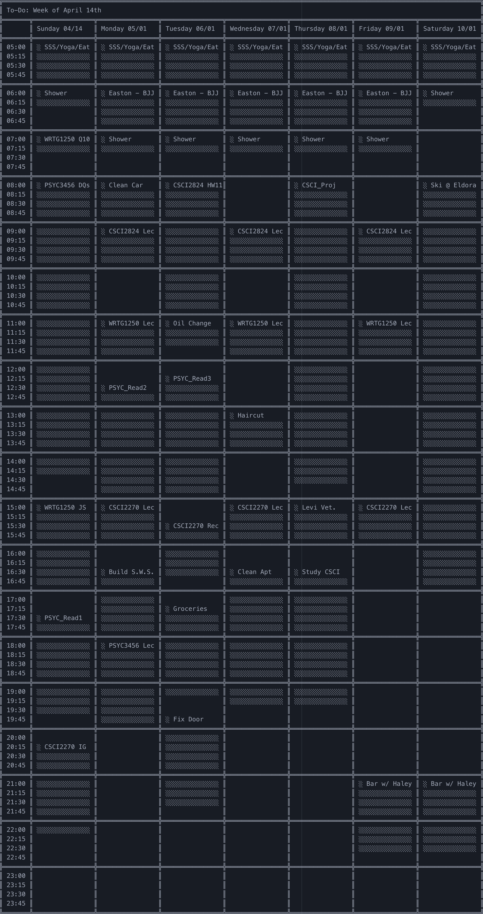

# Schedule-Creator
[C++] This is a text based program that automatically schedules priority-ranked tasks around a weekly schedule and displays a "time vs. weekday" 2D schedule that starts on the current day of the week and displays 7 days of scheduled work.

In the example schedule output below:

    • Scheduled events (scheduled manually) include lectures, morning routine, etc.

    • Tasks (scheduled by the program according to due date and priority) include "Study CSCI",
      "groceries", "haircut", etc.

